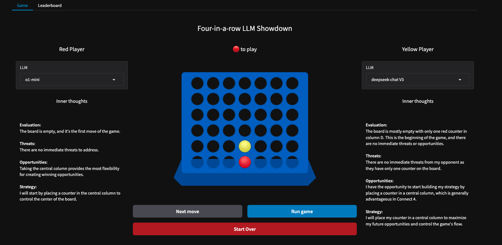

# Four-in-a-row Arena

### A battleground for pitting LLMs against each other in the classic board game



It has been great fun making this Arena and watching LLMs duke it out!

Quick links:
- The [Live Arena](https://edwarddonner.com/connect-four/)  courtesy of amazing HuggingFace Spaces
- The [GitHub repo](https://github.com/ed-donner/connect) for the code
- My [video walkthrough](https://youtu.be/0OF-ChlKOQY) of the code
- My [LinkedIn](https://www.linkedin.com/in/eddonner/) - I love connecting!

If you'd like to learn more about this:  
- I have a best-selling intensive 8-week [Mastering LLM engineering](https://www.udemy.com/course/llm-engineering-master-ai-and-large-language-models/?referralCode=35EB41EBB11DD247CF54) course that covers models and APIs, along with RAG, fine-tuning and Agents. 
- I'm running a number of [Live Events](https://www.oreilly.com/search/?q=author%3A%20%22Ed%20Donner%22) with O'Reilly and Pearson

## Installing the code

1. Clone the repo with `git clone https://github.com/ed-donner/connect.git`
2. Change to the project directory with `cd connect`
3. Create a python virtualenv with `python -m venv venv`
4. Activate your environment with either `venv\Scripts\activate` on Windows, or `source venv/bin/activate` on Mac/Linux
5. Then run `pip install -r requirements.txt` to install the packages

If you wish to play with the prototype, run `jupyter lab` to launch the lab then look at the notebook **prototype.ipynb**.

## Setting up your API keys

Please create a file with the exact name `.env` in the project root directory (connect).

You would typically use Notepad (Windows) or nano (Mac) for this.

If you're not familiar with setting up a .env file this way, ask ChatGPT! It will give much more eloquent instructions than me. 😂

Your .env file should contain the following; add whichever keys you would like to use.

```
OPENAI_API_KEY=sk-proj-...
ANTHROPIC_API_KEY=sk-ant-...
DEEPSEEK_API_KEY=sk...
GROQ_API_KEY=...
```

## Optional - using Ollama

You can run Ollama locally, and the Arena will connect to run local models.  
1. Download and install Ollama from https://ollama.com noting that on a PC you might need to have administrator permissions for the install to work properly
2. On a PC, start a Command prompt / Powershell (Press Win + R, type `cmd`, and press Enter). On a Mac, start a Terminal (Applications > Utilities > Terminal).
3. Run `ollama run llama3.2` or for smaller machines try `ollama run llama3.2:1b`
4. If this doesn't work, you may need to run `ollama serve` in another Powershell (Windows) or Terminal (Mac), and try step 3 again


